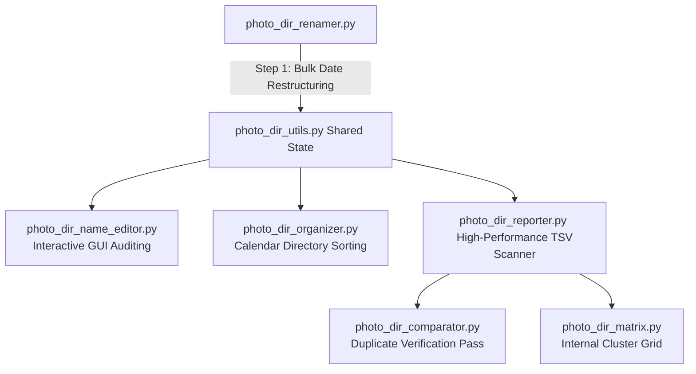

# Photo Migration Pipeline Suite

## 1. Overview
This suite of Python scripts automates the consolidation, metadata 
standardization, and chronological organization of directory names exported 
from Apple Photos or iPhotos. When exporting media by "Moment Name," folders 
contain trailing date strings in English, e.g., 'October 02, 2005', rather than 
a numeric date format, e.g., '2005_10_02' which sorts in chronological order. In 
addition, many exported directory names lack a geographic label. 

"This pipeline fixes these inconsistent folder names by automatically:
1. Restructuring folders into a clear, predictable naming pattern.
2. Cleaning up typos and punctuation in location names.
3. Checking your files against saved lists of known photographers and places.
4. Sorting folders chronologically into a long-term calendar archive."

---

## 2. Naming Convention Schema
The pipeline enforces a standardized naming convention across all operational 
phases:

`YYYY_MM_DD[optional_x]-Photographer-Place_Description`

### Structural Component Rules
1. **Date Anchor:** Exactly a 4-digit year, 2-digit month, and 2-digit day 
   separated by underscores (`YYYY_MM_DD`) derived from the original asset 
   export timeline. An optional lowercase alphabetical single-character suffix 
   (e.g., `_a`, `_b`) is supported to cleanly isolate separate distinct events 
   captured on the exact same date.
2. **Photographer:** A validated alphabetic string representing the person, or 
   at least the owner of the camera, who captured the media (e.g., `KRC`).
3. **Place:** A sanitized geographic identifier in PascalCase. If no location 
   information is available or provided during parsing, the literal placeholder 
   string `place` is substituted.
4. **Description:** An event descriptor or list of individuals present. 
   Delimiter words within this block are joined via underscores (`_`). If left 
   blank, the fallback string `peopleORdescription` is maintained as an 
   indicator for future manual database tagging.

### Transformation Mapping Examples

| Original Apple Photos Directory Name | User Input | Restructured Output Directory Name |
| :--- | :--- | :--- |
| `London, May 27, 2016` | Initials: `KRC` | `2016_05_27-KRC-London_peopleORdescription` |
| `St. Pete Beach, July 31, 2016` | Initials: `KRC` | `2016_07_31-KRC-StPeteBeach_peopleORdescription` |
| `July 28, 2016` | Initials: `KRC` | `2016_07_28-KRC-place_peopleORdescription` |

---

## 3. Pipeline Architecture & Component Scripts
The suite functions as an integrated file processing pipeline. While the 
initial directory renaming script must always run first, the subsequent 
auditing, reporting, matrix parsing, and subdirectory organization layers can 
be executed in flexible combinations based on your personal workflow 
preferences.



### 1. `photo_dir_utils.py` (Shared Utilities)
The central data verification and state persistence layer. It defines color 
profiles for UI windows, manages string token cleaning, handles chronological 
string conversions, and reads/writes configuration contexts to eliminate 
redundant file-system navigation across sequential script runs.

### 2. `photo_dir_renamer.py` (Bulk Restructuring)
This script performs the initial, automated string conversion layer on folder 
batches newly exported as Moments from Photos or from iPhotos.
- **Parsing Strategy:** Uses a right-split mechanism (`rsplit(',', 2)`) to 
  extract the terminal `Month dd, yyyy` string safely, protecting geographic 
  text fields containing internal commas.
- **Text Whitening:** Strips punctuation and symbols using regular expressions, 
  forcing place tokens into strict, alphanumeric PascalCase.
- **Initialization Dialog:** Spawns a custom Tkinter window to prompt the user 
  for a default photographer's initials to apply to the active run.

### 3. `photo_dir_organizer.py` (Calendar Sorting Layer)
The final physical folder moving layer on the file system.
- **Safety Boundaries:** Reads the leading `YYYY_MM` components of standard 
  folder names and strictly matches them against the selected parent year 
  folder to completely prevent accidental cross-year nesting.
- **Physical Relocation:** Dynamically checks for calendar-month target directory 
  structures (e.g., `YYYY/YYYY_MM/`), creates them on disk if missing, and 
  moves matched folders into place utilizing `shutil.move()`.

### 4. `photo_dir_name_editor.py` (Interactive Quality Control)
An interactive validation and metadata quality control script designed to verify 
names against established local records.
- **Fallback Heuristics:** Tokenizes non-standard folder names using hyphen 
  separation anchors if a standard leading date stamp is absent.
- **Validation Form UI:** Flags missing items, unrecognized photographers, or 
  unknown locations in real-time. If an anomaly is identified, it temporarily 
  pauses the script run and populates a multi-field Tkinter interactive editing 
  window, allowing the user to make manual typo corrections or immediately 
  append brand-new authorized terms directly into the tracking database.

### 5. `photo_dir_reporter.py` (High-Performance Reporting Scanner)
A supplementary reporting optimization script designed to recursively scan vast 
target storage volumes and build analytical structural index spreadsheets.
- **Data Scaling:** Implements an iterative, stack-based depth-first search 
  (DFS) pattern that bypasses Python's internal recursive boundaries to 
  safeguard execution against high-volume nested filesystems (>30,000 items).
- **Disk Optimization:** Uses buffered chunk storage alongside `os.scandir` to 
  prevent excessive hardware I/O bottlenecks when tracking massive media arrays 
  stored on remote networks or mounted external hardware blocks.
- **Output Matrix:** Creates a tab-separated data ledger 
  (`{Target_Dir}-file_report.tsv`) tracking deep relative file paths, 
  lowercased extension categorizations, names, modifications, and exact sizes.

### 6. `photo_dir_comparator.py` (Duplicate Detection Layer)
A cross-referencing verification tool that uses the output files from 
`photo_dir_reporter.py` to pinpoint identical files across different volumes.
- **Signature Check:** Cross-references files based on a combined tracking key 
  of their normalized name and exact size (KB).
- **Normalization Match:** Utilizes the central utilities logic to clean file 
  names (such as stripping standard export ' copy' suffixes) before validation, 
  preventing duplicate detection bypasses.
- **Status Ledger:** Generates a comprehensive comparison tracking report sheet 
  (`{Primary_File}_status_report.tsv`) identifying every processed item as 
  uniquely distinct or a pre-existing duplicate, along with its specific path.

### 7. `photo_dir_matrix.py` (Duplicate Cluster Matrix Analyzer)
An advanced analytical tool that reads a single spreadsheet report generated by 
`photo_dir_reporter.py` to isolate and cluster internal folder redundancies.
- **Greedy Clustering:** Evaluates duplicate pairings and implements a grouping 
  algorithm to organize scattered directories into related logical "Sets" 
  based on duplicate density patterns.
- **Analysis Filters:** Includes an interactive configuration panel offering 
  three strict evaluation modes: Full System Matrix (`full`), Subset Matches 
  (`sub`), or Isolated Folder Redundancy (`none`).
- **Pivoted Cross-Tabulation:** Generates a dynamic 2D matrix spreadsheet 
  mapping duplicate file groups as rows and subdirectories as columns, printing 
  file modification timestamps at the grid intersections and calculating total 
  file count column weights at the base.

---

## 4. Shared Configuration & Flat Reference Databases
The pipeline suite depends on three text files located in the runtime working 
workspace and home directories to maintain cross-session continuity:

- **`~/.renamer_config`**: A hidden text file saved inside the user's home path 
  that tracks the absolute directory string of the most recently accessed 
  directory. This allows the file selection dialog windows across all active 
  pipeline operational tools to immediately snap back to your exact working 
  folder.
- **`photographerIDs.txt`**: A tab-separated data file containing unique, 
  authorized photographer strings utilized by the auditing engine.
- **`photoPlaces.txt`**: A tab-separated data file containing unique, verified 
  geographic location tokens used to flag unrecognized place names or spelling 
  errors.

---

## 5. Prerequisites & System Environment
- **Operating System Compatibility:** macOS, Windows, or Linux.
- **Runtime Environment:** Python 3.6 or higher.
- **External Dependencies:** None. Uses Python standard library modules 
  (`os`, `sys`, `re`, `datetime`, `shutil`, `tkinter`, `csv`, `stat`).

---

## 6. Execution Guide

### Initial Staging Pass
1. Export your targeted moments or albums from Apple Photos into a single flat 
   directory.
2. Open your terminal interface and navigate to the pipeline code directory.
3. Launch the primary renamer script:
   ```bash
   python photo_dir_renamer.py
   ```
4. Select the parent staging directory within the file explorer dialog, input
the target photographer initials, and allow the automated string parsing to
execute.

### Auditing and Sorting Options
You can handle the secondary phase using two alternate approaches based on your 
workflow needs:

#### Option A: Organize Folders Immediately to Edit by Month
Run the calendar sort immediately following the initial renamer script 
execution:
```bash
python photo_dir_organizer.py
```
This physically groups your folders into subdirectories labeled by month (e.g., 
`2025_01`, `2025_02`). You can then run the name editor script incrementally 
on a single monthly batch at a time by targeting that specific month folder 
inside the popup file selection box:
```bash
python photo_dir_name_editor.py
```

#### Option B: Clean and Audit Before Sorting (Recommended only for Small Batches)
Run the editor script directly on the flat staging folder to clean all naming 
bugs before directories are migrated into subfolders:
```bash
python photo_dir_name_editor.py
```
Interact with the popup entry boxes to fix flagged metadata warnings. Once all 
console logs return clear of anomalies, run the final organization pass to 
file the clean folders into nested calendar slots:
```bash
python photo_dir_organizer.py
```

### Running Volume Integrity Audits
To inspect structural consistency, discover duplicate data clutter, or isolate 
redundancies spread across backup drives:
1. Generate reports for your target folders using the reporting scanner:
   ```bash
   python photo_dir_reporter.py
   ```
2. Cross-reference a newly staged batch file report against a master repository 
   archive spreadsheet by running the comparator tool:
   ```bash
   python photo_dir_comparator.py
   ```
3. Map out exactly where identical files are located across multiple complex 
   subfolder structures by passing a master scan file to the matrix tool:
   ```bash
   python photo_dir_matrix.py
   ```

---

## 7. Operational Troubleshooting

#### Error: `SKIP: does not contain enough commas` or `extracted end string is not a valid date`
- **Cause:** Occurs within `photo_dir_renamer.py` if a folder does not conform 
  to the expected Apple Photos `Location, Month Day, Year` export syntax wrapper.
- **Resolution:** Skip the folder during bulk renaming, and allow 
  `photo_dir_name_editor.py` to process the folder using its fallback 
  hyphen-tokenization engine during your interactive session.

#### Warning: `Could not save most recently accessed directory`
- **Cause:** The script cannot write to your home profile path due to missing 
  OS folder write permissions.
- **Resolution:** Verify that your system user account has active authorization 
  rights to modify files within the `~` home hierarchy path.